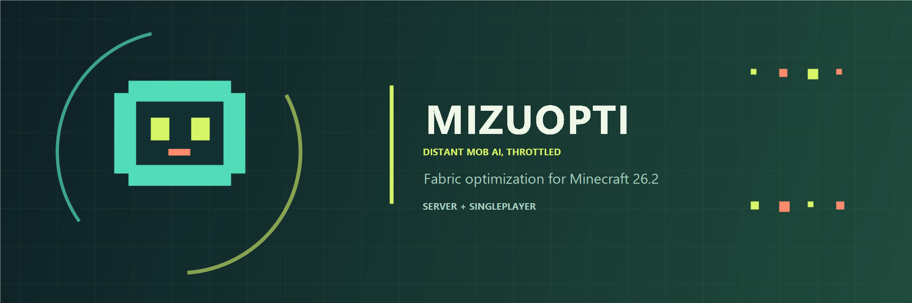

# MizuOpti



Fabric-мод для Minecraft 26.2 с серверной оптимизацией AI и клиентским ограничением отрисовки дальних мобов.

Частота серверного AI зависит от расстояния до ближайшего игрока: ближние мобы обновляются каждый тик, а дальние реже. По умолчанию AI работает раз в 2 тика на расстоянии 32–64 блока, раз в 4 тика на расстоянии 64–128 блоков и раз в 8 тиков дальше 128 блоков. Обычный тик сущности и физика не отключаются.

На клиенте мод не рисует мобов дальше заданного расстояния от камеры. Это сокращает количество отрисовываемых моделей, но не выгружает и не удаляет сущностей. Игроки, снаряды и другие сущности вне класса `Mob` не затрагиваются.

## Настройки

После первого запуска сервера создаётся `config/mizuopti.properties`:

```properties
player-range=32
mid-range=64
mid-ai-interval=2
far-range=128
ai-interval=4
far-ai-interval=8
```

`player-range` задаёт радиус полного AI (0–256 блоков). `mid-range` и `far-range` задают границы следующих зон; каждая автоматически не меньше предыдущей. `mid-ai-interval` управляет частотой AI между `player-range` и `mid-range`, `ai-interval` — между `mid-range` и `far-range`, а `far-ai-interval` — за пределами `far-range` (значения 1–20 тиков). Установка `ai-interval=1` отключает пропуск AI во всех зонах; `mid-ai-interval=1` или `far-ai-interval=1` отключают его только в соответствующей зоне. Изменения применяются при следующем запуске сервера.

Клиентская настройка хранится отдельно в `config/mizuopti-client.properties`:

```properties
mob-render-range=128
```

`mob-render-range` задаёт расстояние от камеры, дальше которого мобы не отрисовываются (0–1024 блока; 0 отключает ограничение). В мультиплеере серверная оптимизация требует мод на сервере, а ограничение отрисовки работает на каждом клиенте с установленным модом. В одиночной игре обе функции работают во встроенном сервере и клиенте.

## Сборка

Требуется JDK 25 и Gradle. Запустите из корня проекта:

```powershell
gradle build
```

Готовый мод появится в `build/libs/`.